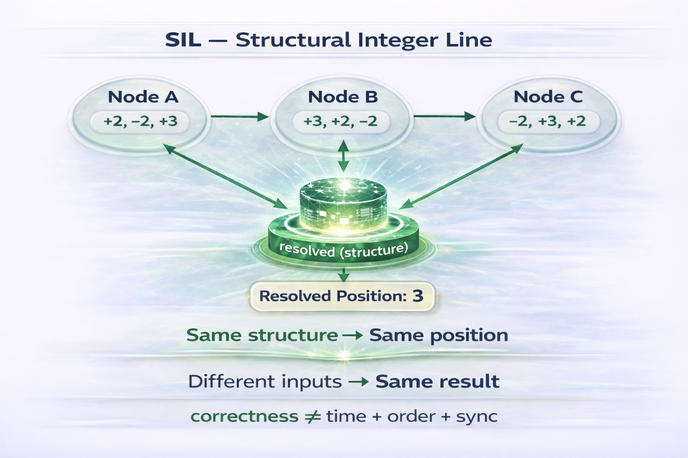

# ⭐ SIL

## Structural Integer Line — Order-Free Structural Motion

### ⭐ The Integer Line Is Not Flat. It Is Structural.

Deterministic position resolution where motion emerges from structure

---

**Structure-Based Motion • Open Reference Implementation**

**No Time • No Order • No Coordinator**  
**No Timestamps • No Synchronization Required for Position**

---

## ⚡ The 5-Second Shock

`Node A != Node B != Node C`

- Different order  
- Different inputs  
- No time  
- No sync  

Yet:

`result_A = result_B = result_C = 3`

This should not be possible.

**But it is.**

`position = resolve(structure)`

**How is this possible?**

---

## 🧭 Visual Overview

---

## ⚡ The Shift

Systems today compute position through sequence.  
**SIL resolves position through structure.**

- Same fragments  
- Same structure  
- Same position  

---

## ⚖️ What This Does NOT Assume

- No global clock  
- No ordering guarantee  
- No synchronization protocol  
- No message arrival guarantees  

Yet correctness is achieved.

**This is not coordination.  
This is structural truth.**

---

## ⚡ Try it in 30 seconds

Open:

`demo/sil_integer_demo_v_1.html`

Interact with:

- Show Node A  
- Show Node B  
- Show Node C  
- Resolve Structure  

Observe:

- same structural fragments produce different visible orders  
- position remains unresolved without structure  
- deterministic convergence after structural resolution  
- identical final position across all permutations

---

## ⚡ What This Proves (In One View)

- Same fragments  
- Different orders  
- Different arrival timelines  
- Different system views  

→ unresolved position  

Apply structural resolution  

→ same final position  

This is convergence **without**:

- time  
- order  
- synchronization  

---

## 🔗 Quick Links

### 📘 Docs
- [Quickstart](docs/Quickstart.md)
- [Proof Sketch](docs/Proof-Sketch.md)
- [FAQ](docs/FAQ.md)
- [Test Guide](docs/Test-Guide.md)
- [Structural Flow](docs/SIL-Structural-Resolution-Flow.png)

---

### ⚡ Demos
- [Python Reference Demo](demo/sil_integer_demo_v2.py)
- [Interactive Demo (HTML)](demo/sil_integer_demo_v_1.html)

---

### 🔍 Verification
- [Demo Hash Freeze](VERIFY/FREEZE_SHA256.txt)

---

### 📂 Repository
- [demo/](demo/) — runnable demonstrations  
- [docs/](docs/) — concepts and usage  
- [VERIFY/](VERIFY/) — reproducibility and hash validation

---

## ⚡ 30-Second Proof

**Step 1:**  
View Node A / B / C  
→ Same fragments → different order → position unclear  

**Step 2:**  
Click **Resolve Structure**

Final Output:

`Final position: 3`

**Key Observation:**

- order changed  
- time irrelevant  
- position unchanged  

**This is not execution.  
This is structural convergence.**

---

## ⚡ The One-Line Breakthrough

Two independent systems receive incomplete, delayed, and out-of-order structural fragments — and still deterministically converge to the exact same final position.

- No ordering guarantees  
- No timing guarantees  
- No synchronization guarantees  

**Yet position is guaranteed by structure.**

---

## ⚡ Structural Invariant

`same structure → same position`

Independent of:

- arrival order  
- timing differences  
- system isolation  

---

## ⚡ Core Truth

Position does not come from order.  
Position does not come from time.  

**Position comes from structure.**

---

## ⚖️ Interpretation Boundary

SIL does not claim that time does not exist.

SIL demonstrates a precise result:

> When structure is sufficient, time is not required to determine position.

This is a **structural sufficiency result — not a physical claim.**

Time may still exist as:

- observer metadata  
- measurement layer  
- external coordination signal  

But it is not required for correctness.

---

## ⚡ Core Identity

`correctness != time + order + sync`  

`position = resolve(structure)`  

`correctness = resolve(structure)`

---

## 🧾 Structural Position in Shunyaya Stack

SIL is the **primitive structural motion proof** within the Shunyaya system.

It completes a foundational sequence:

- SSUM-Time → time can be reconstructed structurally  
- STOCRS → computation resolves structurally  
- SSNT → integers behave as structure  
- SIL → position resolves structurally  

Together:

`correctness = resolve(structure)`

---

## 💡 What SIL Demonstrates

Position correctness does not require:

- timestamps  
- execution order  
- synchronized systems  
- continuous connectivity  

Instead:

`correctness = resolve(structure)`

---

## ⚡ Core Structural Model

Fragments:

- OPEN → base = 0  
- MOVE → id=1, +2  
- RETRACT → id=1  
- MOVE → id=2, +3  
- CONFIRM  

Resolution:

`position = resolve(structure)`

Execution order is irrelevant.

---

## ⚡ Minimal Resolver Definition

Let:

- S = set of structural fragments  
- R = structural rules  

Then:

`position = resolve(S, R)`

Outcomes:

- valid → RESOLVED  
- missing → INCOMPLETE  
- conflicting → ABSTAIN  

---

## ⚖️ What SIL Is / Is Not

**SIL IS:**

- a structural position resolution model  
- a deterministic motion abstraction  
- a convergence-based system  
- a domain extension of SSNT  

**SIL IS NOT:**

- a physics engine  
- a simulation framework  
- a replacement for arithmetic  
- a real-world motion guarantee  

---

## 🔥 Core Structural Law

- valid → RESOLVED  
- missing → INCOMPLETE  
- conflicting → ABSTAIN  

---

## 🛡 Safety Is a Feature

SIL does not force resolution.

- INCOMPLETE → no result  
- ABSTAIN → no unsafe result  

This guarantees:

- no false positives  
- no incorrect position  
- no forced convergence  

---

## 🧮 Structural Guarantees

- Determinism → same structure → same position  
- Order Independence → invariant under permutation  
- Time Independence → no temporal dependency  
- Replay Safety → reproducible outcomes  

---

## 📐 Formal Guarantee (Preview)

For any set S:

For any permutation P:

`resolve(S) = resolve(P(S))`

Safety:

invalid or incomplete S → no false result  

See: `docs/Proof-Sketch.md`

---

## 🔁 Replay Guarantee

`same structure -> same position`

Even if:

- arrival order changes  
- fragments are delayed  
- systems are offline  

---

## 🚀 Open Locally

Open:

`demo/sil_integer_demo_v_1.html`

Or run:

`python demo/sil_integer_demo_v2.py`

Expected:

`Final position: 3`

---

## 🌍 Why This Matters

Traditional systems:

- depend on sequence  
- require ordered execution  
- rely on time  

SIL:

- resolves position deterministically  
- eliminates order dependency  
- enables structure-first motion systems  

---

## ⚡ Minimal Proof Statement

Given:

same structural fragments  

Without:

time  
order  
synchronization  

Result:

`resolve(structure) -> same final position`

---

## 🌍 Real-World Implications

- distributed computation  
- AI state systems  
- control validation  
- robotics motion verification  
- asynchronous systems  

---

## 📜 License

See: [LICENSE](LICENSE)

Reference Implementation: **Open Standard**  
Architecture: CC BY-NC 4.0

---

## 🔗 Related Projects

- [SSUM-Time](https://github.com/OMPSHUNYAYA/SSUM-Time) — time reconstruction without clocks  
- [STOCRS](https://github.com/OMPSHUNYAYA/STOCRS) — order-free computation  
- [SSNT](https://github.com/OMPSHUNYAYA/Structural-Number-Theory) — integers as structure

---

## ⚡ Final Truth

Fragments arrived in different orders.  
Systems saw different inputs.  
Time was irrelevant.  

**Yet position was the same.**

**Correctness is structure.**

---

## ⚡ The Shift in One Line

From:

`position = time + order + execution`

To:

`position = resolve(structure)`

---

## ⭐ The Integer Line Is Not Flat.  
## ⭐ It Is Structural.
